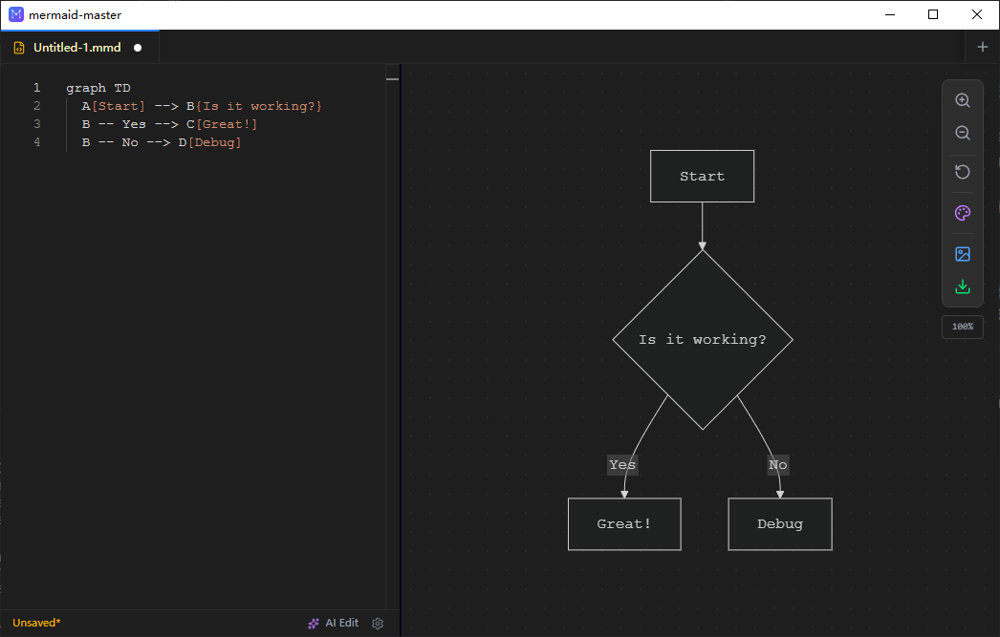
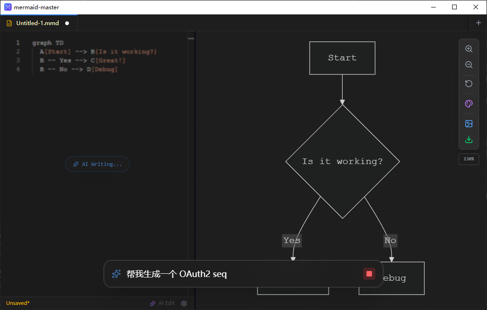
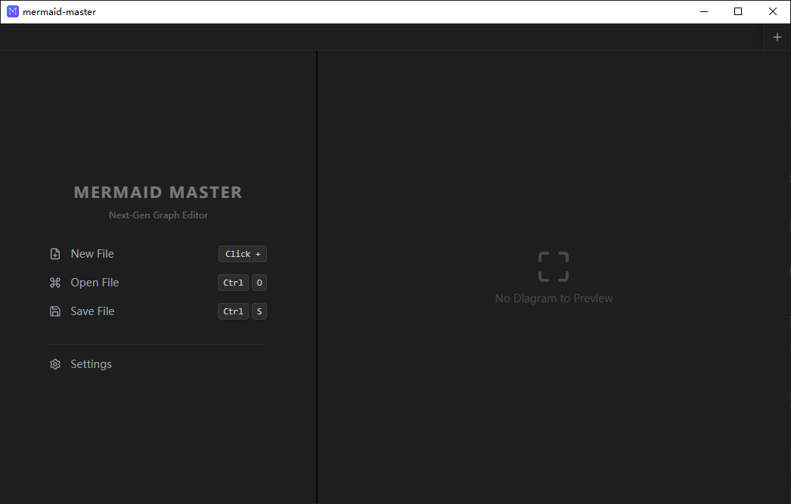
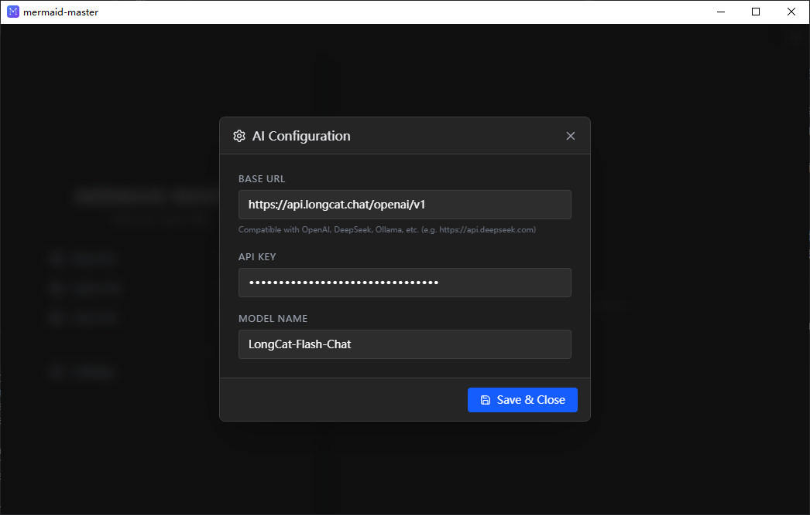
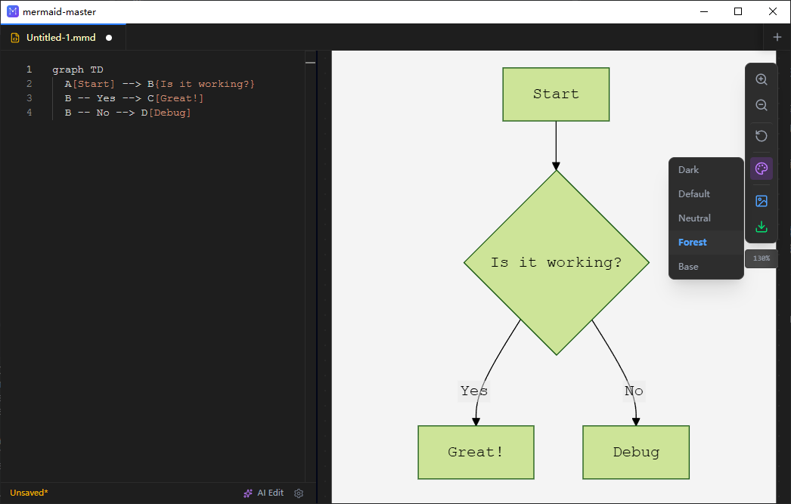

# 🧜‍♀️ **Mermaid Master**  
Next-Gen AI-Native Graph Editor for Developers.

这是一个基于 **Tauri v2 + React 19** 构建的高性能桌面端 Mermaid 编辑器。它深度集成了 **AI 流式生成** 能力，让你通过自然语言即可极速构建复杂的流程图、时序图与架构图。

---

## 📸 界面预览
|                       首页                       |                      AI对话生成                      |                      空白页                      |
|:----------------------------------------------:|:------------------------------------------------:|:---------------------------------------------:|
|  |  |  |

|                        设置                        |                         切换风格                          |
|:------------------------------------------------:|:-----------------------------------------------------:|
|  |  |

## ✨ 核心特性 (Features)

### 🧠 AI Native（智能原生）
- **Command Bar (Ctrl+K)**  
  类似于 IDE 的指令栏。输入自然语言（如“把流程图改成横向，并把颜色改成红色”），AI 实时流式生成 / 修改代码。
- **Context Aware**  
  AI 能够理解当前编辑器中的代码上下文，进行精准的增量修改。
- **Multi-Model Support**  
  兼容 OpenAI、DeepSeek、Ollama 等任何支持 OpenAI 格式的 API。

### ⚡️ 极致编辑体验
- **Monaco Editor 集成**  
  拥有与 VS Code 一致的代码编辑体验（语法高亮、自动补全、缩略图）。
- **多 Tab 管理**  
  支持同时打开、编辑多个 `.mmd` 文件，自动保存会话状态。
- **即时渲染**  
  代码变动毫秒级实时预览。

### 🎨 高级可视化与导出
- **无限画布**  
  基于 `react-zoom-pan-pinch` 实现丝滑的缩放与平移。
- **双模主题**
    - **Dark Mode**：沉浸式暗色编辑器，保护视力
    - **Export Theme**：一键切换为 Light / Neutral 风格，完美适配 Word / PPT
- **高清导出**  
  使用 SVG 高倍率重绘技术，支持导出 3000px+ 的超高清 PNG，彻底告别模糊。

### 🛡️ 安全与隐私
- **Local First**：所有文件读写均在本地完成
- **Direct API Call**：AI 请求直连服务商接口，不经过中间服务器，Key 仅保存在本地 LocalStorage

---

## 🛠️ 技术栈 (Tech Stack)

- **Core**: Tauri v2 (Rust + WebView)
- **Frontend**: React 19
- **Language**: TypeScript
- **Styling**: Tailwind CSS v4 (Oxide Engine)
- **State Management**: Zustand (with Persistence)
- **Editor**: `@monaco-editor/react`
- **Visuals**: Mermaid.js, D3.js, React-Resizable-Panels

---

## 🚀 快速开始 (Getting Started)

### 前置要求
- Node.js (v18+)
- Rust（用于编译 Tauri 后端）

### 安装依赖
```bash
# Clone repository
git clone https://github.com/CIPFZ/mermaid-master.git
cd mermaid-master

# Install dependencies
npm install
```
## 开发模式 (Dev)

    # 启动前端 + Tauri 窗口
    npm run tauri dev

---

## 打包构建 (Build)

构建生成的安装包位于 `src-tauri/target/release/bundle/` 目录下。

    # 构建生产环境包 (Windows .exe / Mac .dmg)
    npm run tauri build

---

## ⌨️ 快捷键 (Shortcuts)

| 快捷键 (Win/Linux) | 快捷键 (Mac) | 功能描述 |
|--------------------|--------------|----------|
| Ctrl + K | Cmd + K | 唤起 AI 指令栏 |
| Ctrl + S | Cmd + S | 保存当前文件 |
| Ctrl + O | Cmd + O | 打开本地文件 |
| Esc | Esc | 关闭指令栏 |

---

## ⚙️ 配置指南 (Configuration)

首次使用 AI 功能前，请点击 **Settings (⚙️)**：

- **Base URL**：使用OpenAI API格式的地址
- **API Key**：你的 API 密钥（仅本地存储）
- **Model**：模型名称（如 `gpt-4o`, `deepseek-chat`）

---

## 📂 项目结构

    mermaid-master/
    ├── src/
    │   ├── components/      # UI 组件
    │   ├── store/           # Zustand 状态管理
    │   ├── utils/           # 工具函数
    │   ├── App.tsx          # 主入口
    │   └── main.tsx         # React 挂载点
    ├── src-tauri/
    │   ├── src/
    │   ├── tauri.conf.json
    │   └── capabilities/
    └── package.json

---

## 🤝 贡献 (Contributing)

欢迎提交 Issue 和 Pull Request！

1. Fork 本仓库
2. 创建 Feature 分支

        git checkout -b feature/AmazingFeature

3. 提交修改

        git commit -m 'Add some AmazingFeature'

4. 推送到分支并创建 Pull Request

---

## 📄 许可证 (License)

Distributed under the **MIT License**. 

